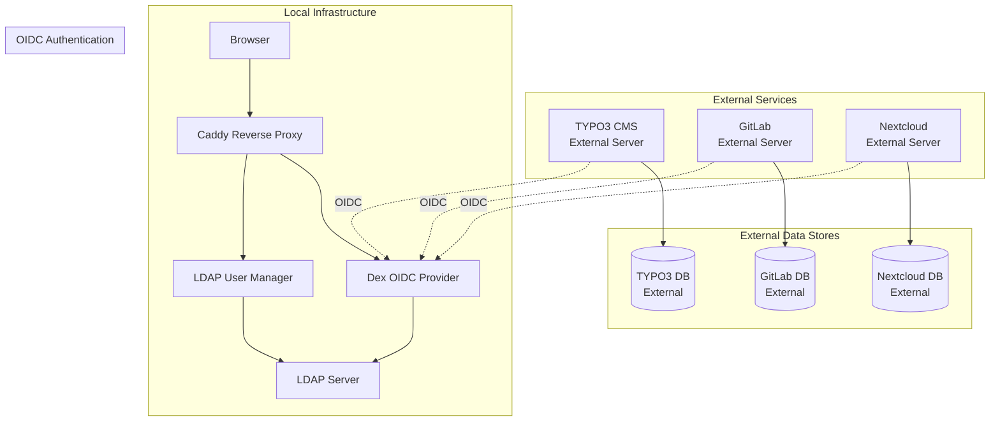
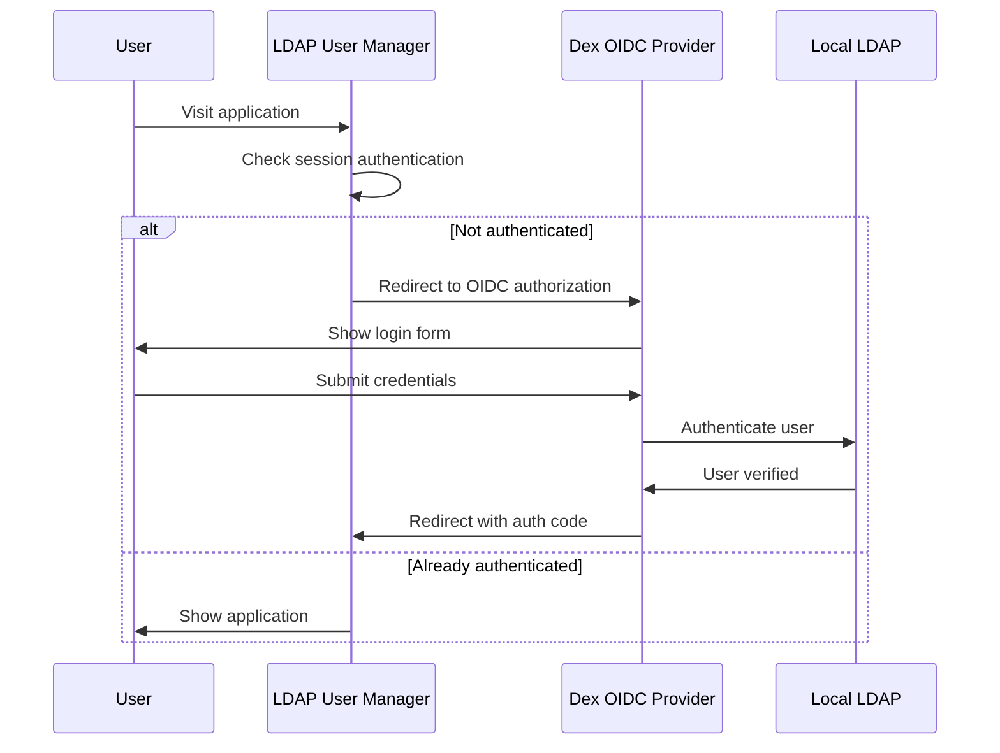
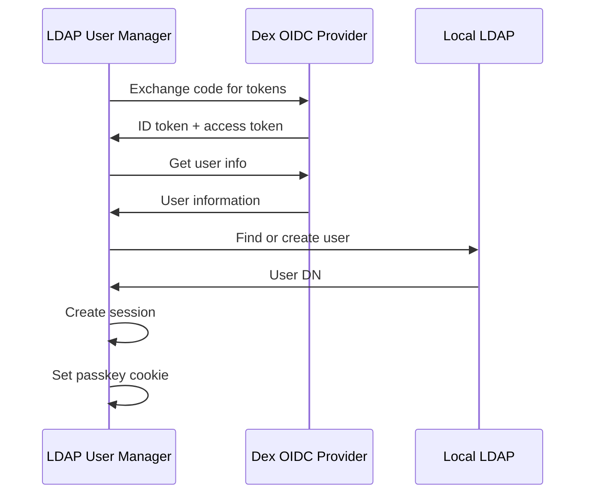
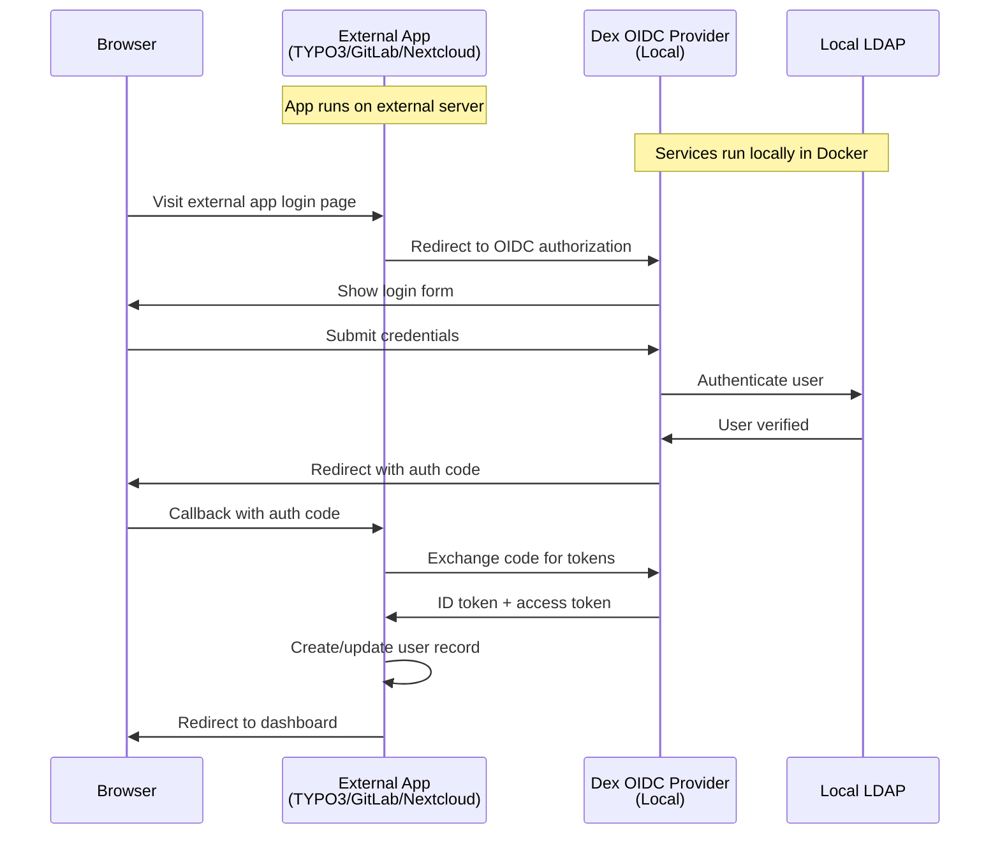

# Identity and Access Management with OpenID Connect

This document describes the OpenID Connect (OIDC) integration using Dex as the identity provider, with LDAP User Manager running locally and TYPO3, GitLab, and Nextcloud running on external servers.

## Architecture Overview

The system uses Dex as an OIDC provider that connects to your existing LDAP infrastructure. Dex and LDAP User Manager run in a local Docker environment, while TYPO3, GitLab, and Nextcloud run on separate external servers and authenticate against Dex over HTTPS.



## OIDC Authentication Flow

### LDAP User Manager Authentication Process

The LDAP User Manager uses **session-based authentication** with OIDC integration, not JWT tokens. Here's the actual flow:

#### 1. User Access and OIDC Redirect


#### 2. OIDC Callback and User Management


#### 3. Session Management
- **Session-based**: Uses PHP sessions, not JWT tokens
- **Cookie-based**: Sets `passkey` cookie for authentication
- **Role-based**: Determines admin/maintainer status from LDAP groups
- **Organization-based**: Links users to their organizations

### Implementation Details

#### OIDC Configuration (`www/includes/oidc_functions.inc.php`)
```php
$OIDC_CONFIG = [
    'enabled' => getenv('OIDC_ENABLED') === 'true',
    'issuer' => getenv('OIDC_ISSUER') ?: 'https://id.example.org',
    'client_id' => getenv('OIDC_CLIENT_ID') ?: 'ldap-user-manager',
    'client_secret' => getenv('OIDC_CLIENT_SECRET') ?: '',
    'redirect_uri' => getenv('OIDC_REDIRECT_URI') ?: 'https://app.example.org/oidc/callback',
    'scopes' => getenv('OIDC_SCOPES') ?: 'openid profile email groups'
];
```

#### Key Functions
- `init_oidc_config()` - Discovers OIDC endpoints
- `generate_oidc_auth_url()` - Creates authorization URL with PKCE
- `exchange_code_for_tokens()` - Exchanges code for tokens
- `validate_id_token()` - Validates JWT ID token
- `get_oidc_user_info()` - Retrieves user information
- `handle_oidc_callback()` - Main callback handler
- `find_or_create_oidc_user()` - Manages user in LDAP

#### User Creation Process
1. **Search existing user** by `uid` in LDAP
2. **Update attributes** if user exists
3. **Create new user** if not found
4. **Set role permissions** based on OIDC groups
5. **Create session** with user information

### External Services OIDC Flow


## Configuration

### Environment Variables

| Variable | Description | Example | Required |
|----------|-------------|---------|----------|
| `OIDC_ENABLED` | Enable OIDC authentication | `true` | Yes |
| `OIDC_ISSUER` | OIDC issuer URL | `https://id.example.org` | Yes |
| `OIDC_CLIENT_ID` | OIDC client identifier | `ldap-user-manager` | Yes |
| `OIDC_CLIENT_SECRET` | OIDC client secret | `your-secret-here` | Yes |
| `OIDC_REDIRECT_URI` | OIDC callback URL | `https://app.example.org/oidc/callback` | Yes |
| `OIDC_SCOPES` | OIDC scopes | `openid profile email groups` | No |

### LDAP Configuration

| Variable | Description | Example | Required |
|----------|-------------|---------|----------|
| `LDAP_URI` | LDAP server URI | `ldaps://ldap-server:636` | Yes |
| `LDAP_BASE_DN` | LDAP base DN | `dc=example,dc=com` | Yes |
| `LDAP_ADMIN_BIND_DN` | Admin bind DN | `cn=admin,dc=example,dc=com` | Yes |
| `LDAP_ADMIN_BIND_PWD` | Admin bind password | `admin123` | Yes |

### Host Configuration

| Variable | Description | Example | Required |
|----------|-------------|---------|----------|
| `SERVER_HOSTNAME` | Application hostname | `app.example.org` | Yes |
| `SERVER_PATH` | Application path | `/` | No |

### External Services OIDC Configuration

| Variable | Description | Example | Required |
|----------|-------------|---------|----------|
| `TYPO3_CLIENT_SECRET` | TYPO3 OIDC client secret | `generated-secret` | Yes |
| `GITLAB_CLIENT_SECRET` | GitLab OIDC client secret | `generated-secret` | Yes |
| `NEXTCLOUD_CLIENT_SECRET` | Nextcloud OIDC client secret | `generated-secret` | Yes |

**Note**: These services run on external servers and only require OIDC client secrets for authentication against the local Dex provider.

## Setup Instructions

### 1. Local Development

#### Prerequisites
- Docker and Docker Compose
- Make (optional, for convenience)

#### Quick Start
```bash
# Clone the repository
git clone https://github.com/pinguts/ldap-user-manager.git
cd ldap-user-manager

# Create certificates directory
mkdir -p certs

# Generate self-signed certificates
openssl req -x509 -newkey rsa:4096 -keyout certs/server.key -out certs/server.crt -days 365 -nodes -subj "/CN=app.example.org"

# Copy certificate for Dex
cp certs/server.crt certs/ca.crt

# Start services
docker-compose up -d

# Check service status
docker-compose ps
```

#### Using Makefile
```bash
# Start all services
make up

# View logs
make logs

# Stop services
make down

# Validate configuration
make validate
```

### 2. Production Deployment

#### DNS Configuration
Configure the following DNS records:

**Local Services (Docker Environment):**
- `app.example.org` → Your server IP (LDAP User Manager)
- `id.example.org` → Your server IP (Dex OIDC Provider)

**External Services (Separate Servers):**
- `typo3.example.org` → TYPO3 server IP
- `gitlab.example.org` → GitLab server IP  
- `nextcloud.example.org` → Nextcloud server IP

#### Certificate Management
For production, replace self-signed certificates with:
- Valid SSL certificates from a trusted CA
- Or use Let's Encrypt with Caddy's automatic ACME support

#### Environment Configuration
Create a `.env` file with production values:
```bash
# OIDC Configuration
OIDC_ENABLED=true
OIDC_ISSUER=https://id.example.org
OIDC_CLIENT_ID=ldap-user-manager
OIDC_CLIENT_SECRET=your-production-secret
OIDC_REDIRECT_URI=https://app.example.org/oidc/callback

# TYPO3 OIDC Configuration
TYPO3_CLIENT_SECRET=your-typo3-production-secret
TYPO3_DB_PASSWORD=your-typo3-db-password
TYPO3_DB_ROOT_PASSWORD=your-mysql-root-password

# LDAP Configuration
LDAP_URI=ldaps://ldap-server:636
LDAP_BASE_DN=dc=example,dc=com
LDAP_ADMIN_BIND_DN=cn=admin,dc=example,dc=com
LDAP_ADMIN_BIND_PWD=your-ldap-admin-password

# Application Configuration
SERVER_HOSTNAME=app.example.org
```

## Security Checklist

### TLS Configuration
- [ ] HTTPS enforced with HTTP to HTTPS redirect
- [ ] TLS 1.2+ protocols only
- [ ] Valid SSL certificates (not self-signed in production)
- [ ] HSTS headers enabled

### Authentication Security
- [ ] OIDC PKCE flow implemented
- [ ] State parameter validation
- [ ] Token expiration: ID token 15 minutes, refresh token 24 hours
- [ ] Secure session management

### Network Security
- [ ] LDAP communication encrypted (LDAPS)
- [ ] Internal network isolation
- [ ] Rate limiting enabled
- [ ] Security headers configured

### Secret Management
- [ ] Client secrets not hardcoded
- [ ] Environment variables for sensitive data
- [ ] Docker secrets for production
- [ ] Regular secret rotation

### Access Control
- [ ] Role-based access control maintained
- [ ] Group membership validation
- [ ] Break glass admin account available
- [ ] Audit logging enabled

## Troubleshooting

### Common Errors

#### Invalid Redirect URI
**Error**: "Invalid redirect_uri" in Dex logs
**Solution**: Ensure `OIDC_REDIRECT_URI` matches exactly in both Dex config and app environment

#### LDAP Connection Issues
**Error**: "Failed to bind to LDAP server"
**Solution**: 
- Verify LDAP credentials
- Check LDAP server health
- Ensure LDAPS is properly configured

#### Clock Skew
**Error**: "Token expired" or "Invalid token"
**Solution**: 
- Synchronize system clocks
- Check timezone settings
- Verify token expiration times

#### Certificate Trust Issues
**Error**: "SSL certificate verify failed"
**Solution**:
- Verify certificate validity
- Check certificate chain
- Ensure proper CA certificates

#### TYPO3 OIDC Issues
**Error**: "Invalid redirect URI" in TYPO3
**Solution**:
- Ensure redirect URI matches exactly in both Dex and TYPO3
- Check that the loginProvider parameter is correct
- Verify TYPO3 extension configuration

**Error**: "User not found" after OIDC login
**Solution**:
- Check user mapping configuration
- Verify LDAP group membership
- Check TYPO3 user creation settings

#### GitLab OIDC Issues
**Error**: "OmniAuth error" in GitLab
**Solution**:
- Verify OIDC client configuration in gitlab.rb
- Check client secret matches Dex configuration
- Ensure GitLab can reach the OIDC issuer

**Error**: "User not created" after OIDC login
**Solution**:
- Check `omniauth_block_auto_created_users` setting
- Verify user attribute mapping
- Check GitLab logs for detailed error messages

#### Nextcloud OIDC Issues
**Error**: "OIDC Login app not found"
**Solution**:
- Install the OIDC Login app via Nextcloud app store
- Verify app is enabled in Nextcloud admin panel
- Check app configuration

**Error**: "Invalid OIDC configuration"
**Solution**:
- Verify OIDC provider URL is accessible
- Check client ID and secret match Dex configuration
- Ensure redirect URI is correctly configured

### Debug Mode

Enable debug logging by setting:
```bash
LDAP_DEBUG=true
SESSION_DEBUG=true
OIDC_DEBUG=true
```

### Health Checks

Check service health:
```bash
# Check all services
docker-compose ps

# Check specific service
docker-compose exec dex wget -qO- http://localhost:5556/healthz

# Check LDAP
docker-compose exec ldap ldapsearch -x -H ldaps://localhost:636 -b dc=example,dc=com -D cn=admin,dc=example,dc=com -w admin123
```

## Verification Plan

### 1. Service Startup
- [ ] All containers start successfully
- [ ] Health checks pass
- [ ] No error messages in logs

### 2. OIDC Discovery
- [ ] Visit `https://id.example.org/.well-known/openid_configuration`
- [ ] Verify all endpoints are accessible
- [ ] Check issuer matches configuration

### 3. Authentication Flow
- [ ] Visit `https://app.example.org`
- [ ] Redirect to Dex login page
- [ ] Login with LDAP credentials
- [ ] Return to application with valid session

### 4. User Claims
- [ ] Check ID token contains required claims
- [ ] Verify `sub`, `email`, `name`, `groups` present
- [ ] Confirm groups match LDAP membership

### 5. External Services OIDC Integration
- [ ] **TYPO3** (External Server):
  - [ ] TYPO3 is accessible at configured URL
  - [ ] OIDC extension is properly configured
  - [ ] Login redirects to Dex OIDC provider
  - [ ] User returns to TYPO3 with valid session
  - [ ] New users are created in TYPO3 automatically
  - [ ] Group mapping works correctly

- [ ] **GitLab** (External Server):
  - [ ] GitLab is accessible at configured URL
  - [ ] OIDC OmniAuth provider is properly configured
  - [ ] Login redirects to Dex OIDC provider
  - [ ] User returns to GitLab with valid session
  - [ ] New users are created in GitLab automatically
  - [ ] User attributes are properly mapped

- [ ] **Nextcloud** (External Server):
  - [ ] Nextcloud is accessible at configured URL
  - [ ] OIDC Login app is properly configured
  - [ ] Login redirects to Dex OIDC provider
  - [ ] User returns to Nextcloud with valid session
  - [ ] New users are created in Nextcloud automatically
  - [ ] Group membership is properly mapped

### 8. Authorization
- [ ] Test role-based access control
- [ ] Verify admin functions work for admin users
- [ ] Confirm maintainer functions work for maintainers

### 9. Session Management
- [ ] Session persists across page reloads
- [ ] Logout properly clears session
- [ ] Token refresh works if enabled

## Quick Start Commands

```bash
# Start all services
docker-compose up -d

# View logs
docker-compose logs -f

# Stop services
docker-compose down

# Restart specific service
docker-compose restart dex

# Check service status
docker-compose ps

# Access Dex directly
curl -k https://id.example.org/.well-known/openid_configuration

# Test LDAP connection
docker-compose exec ldap-user-manager ldapsearch -x -H ldaps://ldaps://ldap-server:636 -b dc=example,dc=com -D cn=admin,dc=example,dc=com -w admin123

# Test external service connections (these run on separate servers)
curl -k https://typo3.example.org/
curl -k https://gitlab.example.org/
curl -k https://nextcloud.example.org/

# Test local services
docker-compose exec ldap-server ldapsearch -x -H ldaps://localhost:636 -b dc=example,dc=example,dc=com -D cn=admin,dc=example,dc=com -w admin123
curl -k https://id.example.org/.well-known/openid_configuration
```

## Comprehensive Verification Checklist

### Local Infrastructure Verification
```bash
# 1. Check all services are running
docker-compose ps

# 2. Verify Dex OIDC discovery endpoint
curl -k https://id.example.org/.well-known/openid_configuration

# 3. Test LDAP User Manager
curl -k https://app.example.org/

# 4. Check LDAP connectivity
docker-compose exec ldap-server ldapsearch -x -H ldaps://localhost:636 -b dc=example,dc=com -D cn=admin,dc=example,dc=com -w admin123
```

### External Service Verification
```bash
# 1. Test TYPO3 connectivity
curl -k https://typo3.example.org/

# 2. Test GitLab connectivity  
curl -k https://gitlab.example.org/

# 3. Test Nextcloud connectivity
curl -k https://nextcloud.example.org/

# 4. Verify OIDC discovery from external servers
curl -k https://id.example.org/.well-known/openid_configuration
```

### OIDC Flow Testing
1. **Visit external service login page**
2. **Click OIDC login button**
3. **Should redirect to Dex at `https://id.example.org/auth`**
4. **Login with LDAP credentials**
5. **Should redirect back to external service**
6. **User should be logged in with proper attributes**

## External Service Configuration

The following services run on external servers and must be configured to authenticate against your local Dex OIDC provider.

**📖 For detailed configuration instructions, see the [Services Directory](../services/)**

### Quick Configuration Summary

#### TYPO3
- Install `causal/oidc` extension
- Configure OIDC settings in backend
- Set redirect URI to `https://typo3.example.org/index.php?eID=oidc`

#### GitLab  
- Install `omniauth-openid-connect` gem
- Configure OmniAuth in `gitlab.rb`
- Set redirect URI to `https://gitlab.example.org/users/auth/openid_connect/callback`

#### Nextcloud
- Install OIDC Login app
- Configure via OCC commands or `config.php`
- Set redirect URI to `https://nextcloud.example.org/index.php/apps/oidc_login/oidc`


## Adding New OIDC Clients

### 1. Update Dex Configuration
Add a new client to `dex/config.yaml`:

```yaml
staticClients:
  # ... existing clients ...
  - id: new-app
    redirectURIs:
      - https://new-app.example.org/oidc/callback
    name: "New Application"
    secret: ${NEW_APP_CLIENT_SECRET}
    public: false
    trustedPeers: []
    applicationType: web
```

### 2. Add Environment Variables
Add to `env.example` and `.env`:

```bash
# New App OIDC Configuration
NEW_APP_CLIENT_SECRET=your-new-app-client-secret-here
```

### 3. For External Services
If the new client runs on an external server:
- No Docker Compose changes needed
- No reverse proxy changes needed
- Only update Dex configuration and environment variables

### 4. For Local Services
If the new client runs in the same Docker environment:
- Add service to `docker-compose.yml`
- Add routing in `caddy/Caddyfile`
- Add volumes if needed

### 5. Update DNS
Add DNS record:
- `new-app.example.org` → Server IP (local or external)

### 6. Generate Client Secret
Run the setup script to generate a new secret:
```bash
./setup-oidc.sh
```

## Security and Operations

### Security Checklist
- [ ] **TLS Enforcement**: All external communication uses HTTPS
- [ ] **Token Lifetimes**: ID tokens expire in 15 minutes, refresh tokens in 24 hours
- [ ] **Secret Management**: All client secrets stored in environment files (git-ignored)
- [ ] **Network Isolation**: LDAP runs in private Docker network, not exposed to internet
- [ ] **Certificate Management**: Valid SSL certificates for all external domains
- [ ] **Break Glass Accounts**: Local admin accounts configured in each external service
- [ ] **Monitoring**: Dex logs and authentication events are monitored
- [ ] **Access Control**: LDAP bind credentials are secure and rotated regularly

## Production Deployment

### Pre-Deployment Checklist
- [ ] **DNS Configuration**: All domains point to correct server IPs
- [ ] **SSL Certificates**: Valid certificates for all domains
- [ **Firewall Rules**: Ports 80, 443, 22 open, others restricted
- [ ] **Network Security**: LDAP network isolated, no internet access
- [ ] **Client Secrets**: All OIDC client secrets generated and secure
- [ ] **Monitoring**: Log aggregation and alerting configured
- [ ] **Backup Strategy**: Automated backup procedures in place

### Security Hardening
- [ ] **SSL Certificates**: Use valid certificates from trusted CA (not self-signed)
- [ ] **Firewall Rules**: Restrict access to only necessary ports (80, 443, 22)
- [ ] **Network Isolation**: Ensure LDAP network is completely private
- [ ] **Secret Rotation**: Implement regular rotation of OIDC client secrets
- [ ] **Monitoring**: Set up alerts for failed authentication attempts
- [ ] **Backup Strategy**: Regular backups of LDAP data and configuration

### Performance Optimization
- [ ] **Resource Limits**: Set appropriate memory and CPU limits for containers
- [ ] **Database Tuning**: Optimize LDAP server configuration for your use case
- [ ] **Caching**: Consider Redis for session caching if needed
- [ ] **Load Balancing**: Use multiple Dex instances behind a load balancer for high availability

### Post-Deployment Verification
- [ ] **OIDC Discovery**: `https://id.example.org/.well-known/openid_configuration` accessible
- [ ] **Local Services**: LDAP User Manager and Dex working correctly
- [ ] **External Services**: All three external services can reach Dex
- [ ] **Authentication Flow**: Complete OIDC login flow works end-to-end
- [ ] **User Provisioning**: New users created automatically in external services
- [ ] **Group Mapping**: User groups properly mapped from LDAP

## Support and Maintenance

### Regular Tasks
- Monitor service health and logs
- Rotate OIDC client secrets
- Update SSL certificates
- Review audit logs
- Test backup and recovery procedures
- Monitor user creation and group mapping across all applications
- Verify external service connectivity and OIDC configuration

### Monitoring
- Service health endpoints
- Application error logs
- LDAP connection status
- OIDC authentication metrics

### Backup
- LDAP data volumes
- Application configuration
- SSL certificates
- Environment variables

For additional support, refer to:
- [Dex Documentation](https://dexidp.io/docs/)
- [OpenID Connect Specification](https://openid.net/connect/)
- [LDAP User Manager Documentation](./README.md)
- [OIDC Quick Reference](./integrations/oidc-quick-reference.md)
